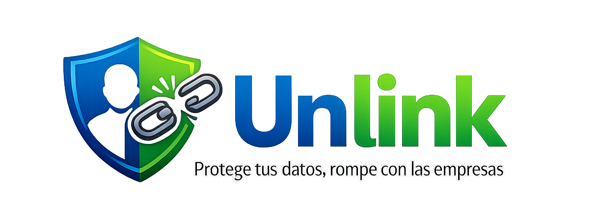
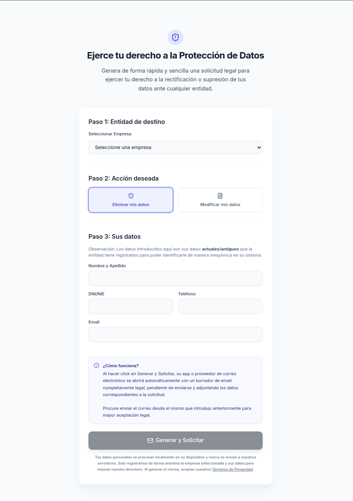
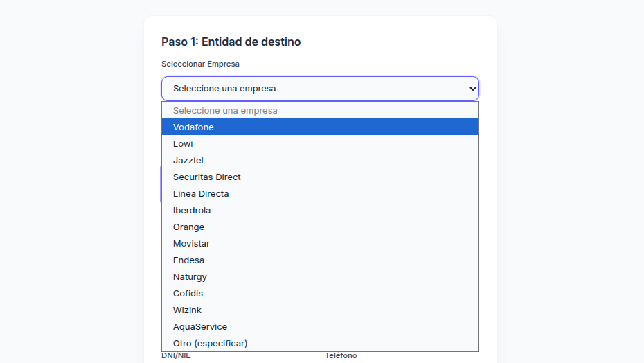
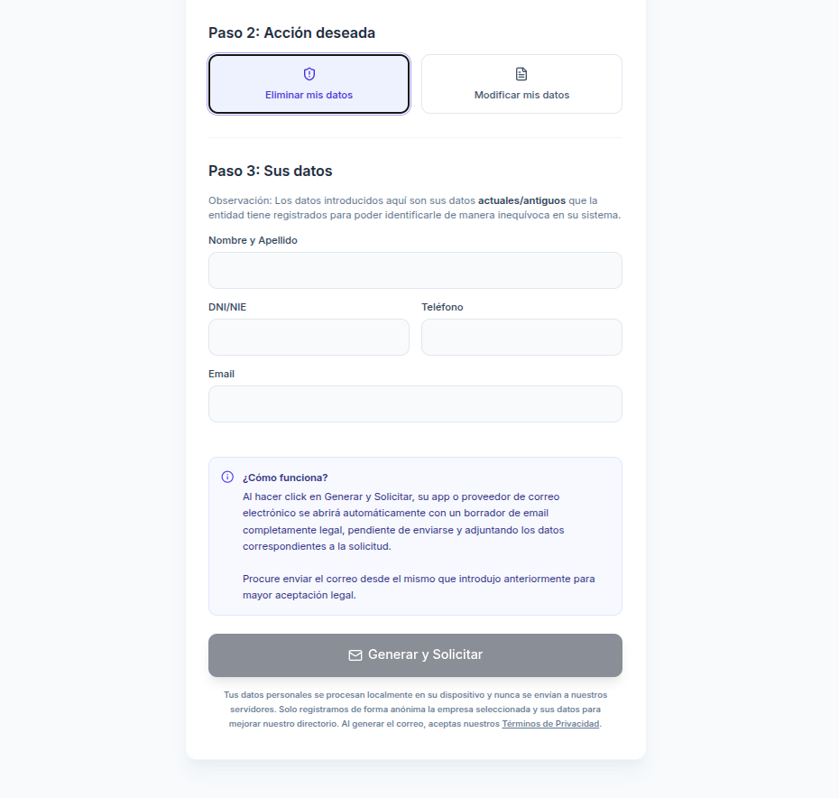
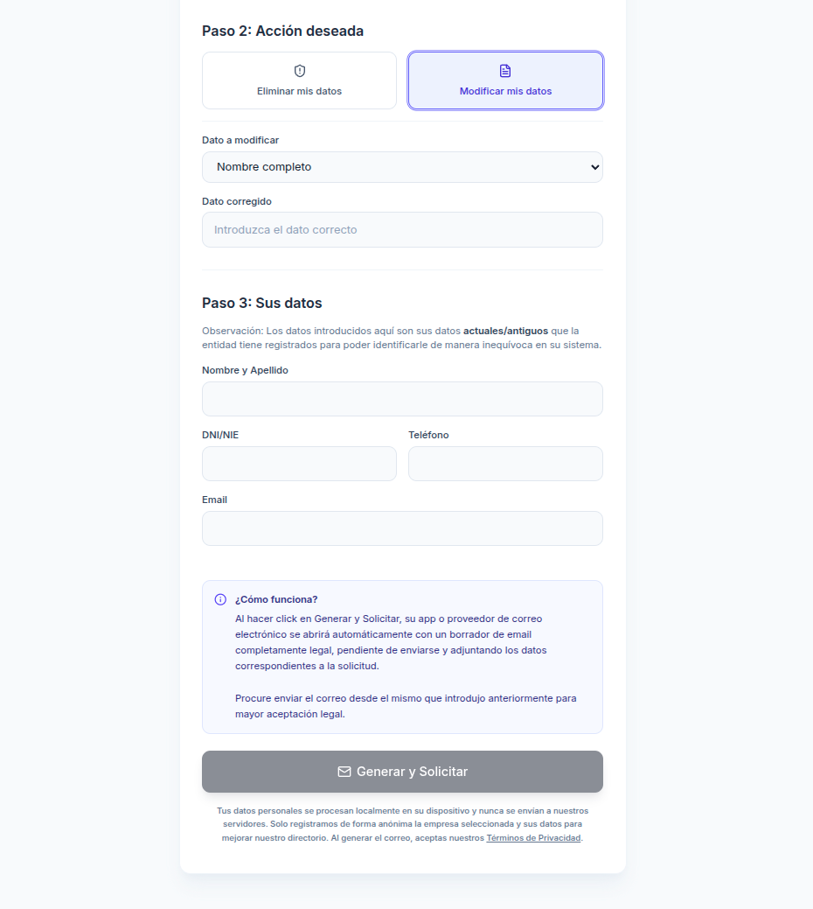

<div align="center">
  
  <h1>Unlink</h1>
  <p><strong>Ejercicio de Derechos de Protección de Datos</strong></p>

  <a href="https://unlink-data.vercel.app" target="_blank">
    
  </a>

  <br /><br />

  <a href="https://github.com/elianurl/Unlink/blob/main/LICENSE">
    
  </a>
  
  
  
</div>

---

<div align="center">

🔗 **[unlink-data.vercel.app](https://unlink-data.vercel.app)**

_Genera solicitudes legales de rectificación o supresión de datos personales en segundos._

</div>

---

## Índice

- [Qué es Unlink](#qué-es-unlink)
- [Principios](#principios)
- [Características](#características)
- [Cómo funciona](#cómo-funciona)
- [Stack](#stack)
- [Arquitectura](#arquitectura)
- [Local](#local)
- [Producción](#producción)
- [Moderación](#moderación)

---

## Qué es Unlink

Unlink es una herramienta de código abierto para ejercer tus **derechos ARCO** (Acceso, Rectificación, Cancelación y Oposición) ante cualquier entidad española.

**Sin registros. Sin datos enviados a servidores. Sin inteligencia artificial.** Todo el procesamiento ocurre en tu navegador. Solo tú y tu derecho a la protección de datos.

---

## Principios

- **Privacidad por diseño** — Tus datos personales nunca salen de tu dispositivo.
- **Transparencia total** — Código 100% auditable. Sin dependencias opacas.
- **Derechos reales** — No es una herramienta técnica. Es un activador ciudadano.

---

## Características

| Característica | Descripción |
|---------------|-------------|
| **Plantillas legales** | Correos conformes al RGPD y LOPDGDD, listos para enviar. |
| **Búsqueda DPO** | Rastreo ético de emails de protección de datos, respetando `robots.txt`. |
| **Directorio colaborativo** | Emails aportados por la comunidad, moderados antes de publicarse. |
| **Sin IA** | Sin modelos de lenguaje, sin tokens de API, sin costes ocultos. |
| **Panel de moderación** | Revisa y aprueba sugerencias con un token seguro. |

---

## Cómo funciona

La herramienta sigue un flujo guiado en tres pasos. La captura general muestra la vista principal de la app en formato vertical.

<p align="center">
  
</p>

1. **Paso 1: Entidad de destino**
   - El usuario selecciona la empresa o entidad sobre la que quiere ejercer el derecho de **supresión** o **rectificación**.
   - Si elige una entidad del listado, la app intenta recuperar emails relacionados con protección de datos.
   - Si no hay resultados automáticos, puede usar **Comprobar en Google** para abrir una búsqueda con `nombre de la entidad + protección de datos`.
   - Cuando aparece un email sugerido, el usuario puede verificarlo con el enlace **comprobar** junto al correo, que abre una búsqueda en el navegador para confirmar que sigue vigente.

<p align="center">
  
</p>

2. **Paso 2: Acción deseada**
   - **Eliminar mis datos**: el usuario completa sus datos identificativos y de contacto para generar una solicitud de supresión.
   - **Modificar mis datos**: además de los datos personales, se selecciona el campo a corregir en **Dato a modificar** y se introduce el valor correcto en **Dato corregido**.
   - Si se selecciona **DNI/NIE** como campo a modificar, la interfaz recuerda que deberá adjuntarse documentación justificativa.

<p align="center">
  
</p>

<p align="center">
  
</p>

3. **Paso 3: Sus datos**
   - Se completan los campos personales obligatorios: **Nombre completo**, **DNI/NIE**, **Email** y **Teléfono**.
   - Cuando la información requerida está completa, se habilita el botón **Generar y Solicitar**.
   - Al pulsarlo, la app abre el proveedor de correo del dispositivo con un borrador ya redactado y listo para enviar.

---

## Stack

**Frontend:** React 19 · TypeScript · Tailwind CSS 4 · Framer Motion · Lucide React

**Backend:** Node.js · Express · TypeScript · Heurística propia (sin APIs de terceros)

---

## Arquitectura

```
Frontend (React + Vite)
    |
    +-- /api/dpo-email      → Búsqueda de emails DPO (rastreo con caché)
    +-- /api/approved       → Directorio público
    +-- /api/track          → Registro anónimo de visitas
    +-- /api/empresas/stats → Estadísticas anónimas de uso
    +-- /api/admin/stats    → Métricas agregadas (token)
    +-- /admin              → Panel de moderación y estadísticas

Backend (Express)
    |
    +-- data/pending.json   → Sugerencias en revisión
    +-- data/approved.json  → Directorio aprobado
    +-- data/audit.log      → Auditoría de moderación
    +-- data/stats.json     → Estadísticas de uso (runtime, no versionado)
```

### Seguridad y resiliencia

Para resistir abusos y picos de tráfico (DoS), el backend incluye, sin
dependencias externas:

- **Rate limiting por IP** con ventana deslizante: límite global de la API y
  uno más estricto para la búsqueda DPO (que genera peticiones salientes).
- **Caché de rastreos** y **tope de búsquedas concurrentes** para evitar la
  amplificación de peticiones.
- **Límite de tamaño del cuerpo** (16 kB) y **cabeceras de seguridad**
  (`nosniff`, `X-Frame-Options`, `Referrer-Policy`, `Permissions-Policy`).
- **Protección anti-SSRF**: solo se rastrean dominios públicos, nunca hosts
  internos ni IPs literales.

### Estadísticas de uso

Se registran de forma **anónima y agregada** (sin datos personales ni IPs):
visitas, solicitudes generadas, tipo de acción (supresión/rectificación),
búsquedas de email y un ranking de empresas. Visibles en `/admin` con el
`ADMIN_TOKEN`.

---

## Local

**Requisito:** Node.js 20+

```bash
npm install

# Crea un `.env.local` con `ADMIN_TOKEN`
cp .env.example .env.local
node -e "console.log(require('crypto').randomBytes(32).toString('base64'))"

npm run dev
```

App en **http://localhost:3000** · Panel en **http://localhost:3000/admin**

---

## Producción

**Frontend (Vercel):**
- Framework: `Other`
- Build: `vite build`
- Output: `dist`
- Env: define las variables del frontend que necesite la app

**Backend (Render / Railway):**
- Start: `node dist/server.cjs`
- Env: `ADMIN_TOKEN` (se inyecta automáticamente desde el panel de entorno)
- **Importante:** Requiere persistencia de disco para `data/`.

**Token admin**
- Genera uno nuevo con `node -e "console.log(require('crypto').randomBytes(32).toString('base64'))"`
- Guárdalo en `.env.local` para desarrollo y en el panel de entorno de Vercel para producción
- Si lo cambias, actualiza el valor local y el de producción al mismo tiempo

**No subir secretos a GitHub**
- `.env`, `.env.local` y variantes locales están ignoradas por Git
- El archivo real debe quedar solo en tu máquina o en Vercel, nunca en el repo

---

## Moderación

1. Accede a `/admin`.
2. Introduce tu `ADMIN_TOKEN`.
3. Revisa, aprueba o rechaza sugerencias.

---

## Contribuir

Consulta [CONTRIBUTING.md](./CONTRIBUTING.md). Toda aportación pasa por revisión manual.

---

## Licencias

- **Código:** MIT ([LICENSE](./LICENSE))
- **Datos:** CC BY 4.0 ([DATA_LICENSE.md](./DATA_LICENSE.md))

---

<div align="center">

Desarrollada con compromiso por **[Elian De Valois](https://github.com/elianurl)**

> "La tecnología debe servir a los derechos de las personas, no al revés."

</div>
